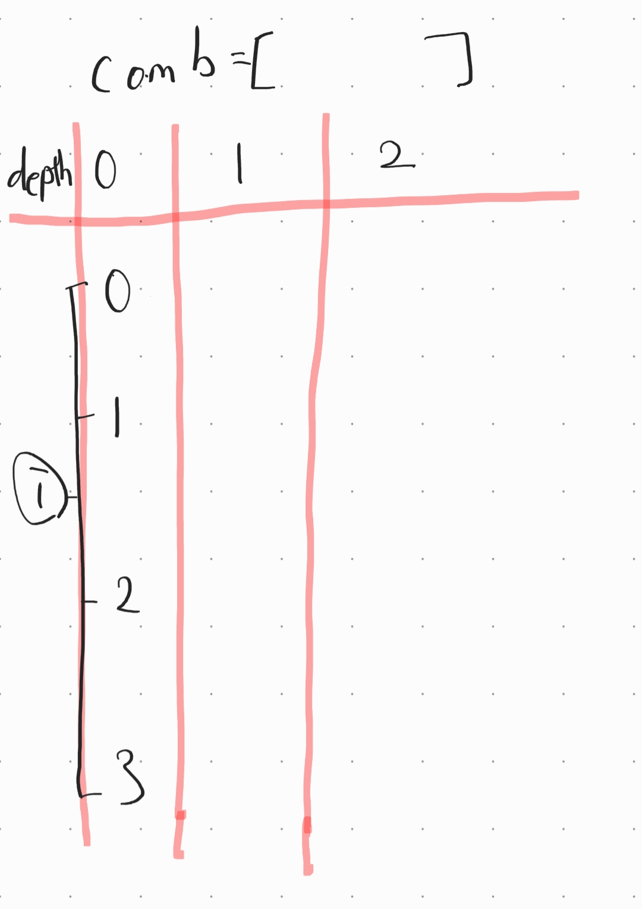
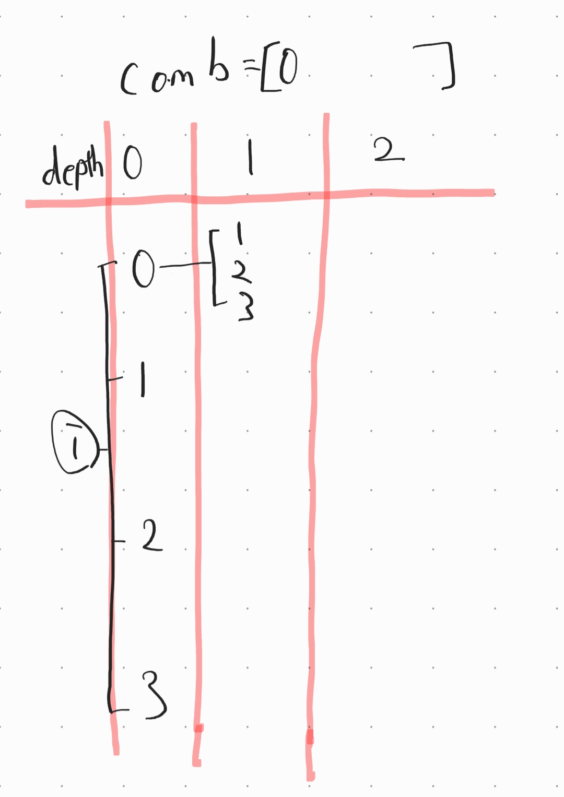
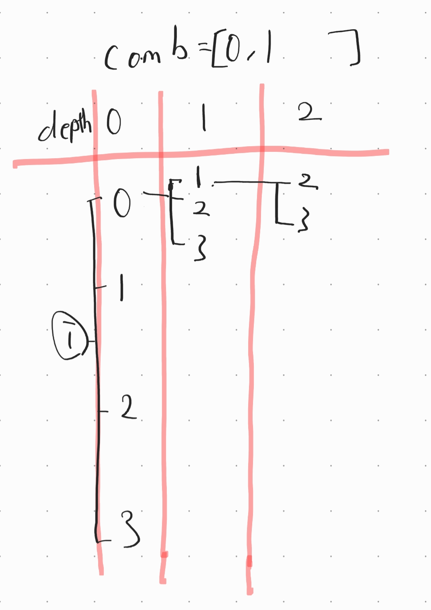
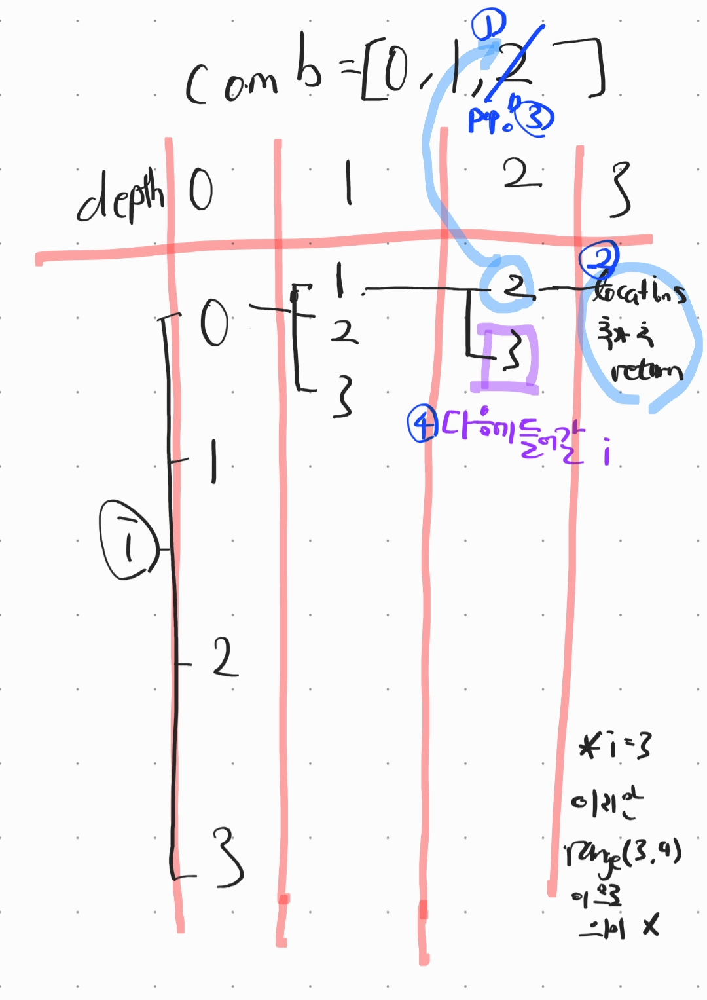
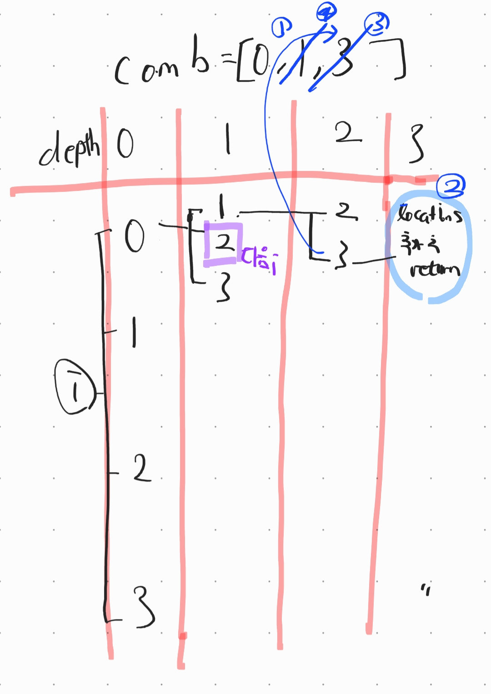
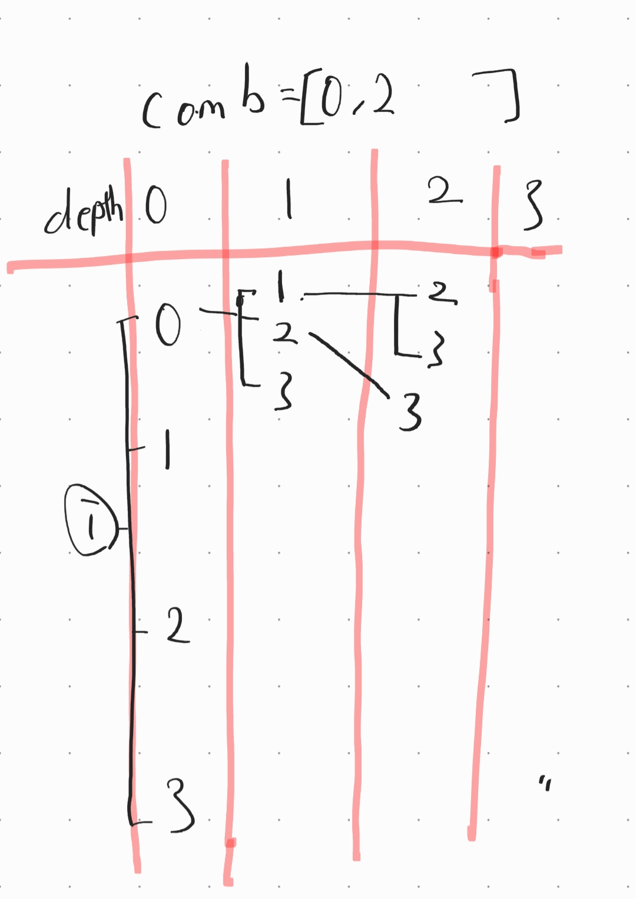
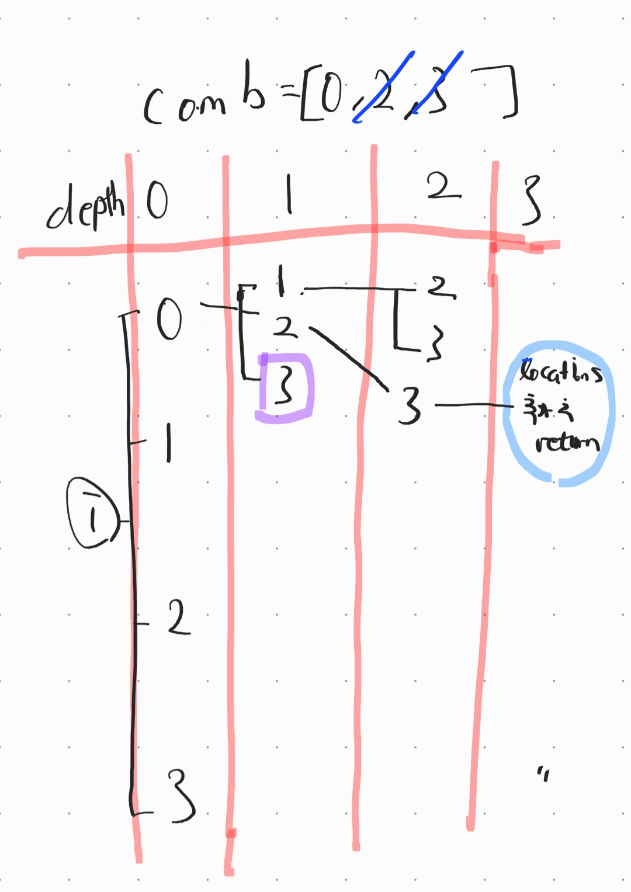

# 치킨 배달 파이썬 풀이

(https://www.acmicpc.net/problem/15686)


## *** 아이디어 ***

1. 1은 집, 

   2는 치킨집,

   0은 그  이외 빈 공간을 가리키는 '2차원 행렬'이 주어진다.

2. 주어진 치킨집 중 M개를 뽑는다(다른 치킨집은 무시하고 뽑힌 치킨집만 존재하는 가상 세계 i가 있다고 가정 i의 개수는 치킨집들을 M개씩 뽑는 조합의 개수). 

3. 각 집마다 뽑힌 지점들과의 거리를 모두 구한 후 각 집의 입장에서 가장 가까운 치킨집과의 거리만 남겨 그 거리들을 모두 더해줌(결과값  = 가상 세계 i에서의 치킨거리)

4. 가상세계0의 치킨 거리를 dist_sum변수에 담아준다.  이후 다음 가상 세계의 치킨거리가  그 바로 이전 가상 세계의 치킨거리보다 값이 작다면 그 더 작은 값으로 dist_sum변수값을 갱신해준다.(최소값 구하는 과정)

   -끝-


## *** 코드 분석 ***

1. N과 M을 정수 입력값으로 받는다. N은 N * N 2차원 행렬을 만들기 위해 받는 수이고,  M은 치킨집 몇 개를 한 조합으로 만들지를 결정해 주는 수이다.
2. link라는 빈 리스트를 만든 후, 이어지는 입력값들을 넣어주어 치킨집, 집 그리고  나머지 빈 공간들의 위치를 담은 지도를 만든다.

```python
N, M = map(int, input().split())

link = []
for i in range(N):
	link.append(list(map(int, input().split())))
	
```
3. chicken리스트에는 치킨집의 좌표를 넣어주고, home리스트에는 집의 좌표를 넣어준다.
ex)
chicken = [[0, 1], [3, 0], [4, 0], [4, 1], [4, 4]]
home = [[0, 3], [1, 0], [1, 2], [3, 3], [3, 4], [4, 3]]
```python
chicken = []
home = []
for r in range(N):
    for c in range(N):
        if link[r][c] == 2:
            chicken.append([r,c])
        elif link[r][c] == 1:
            home.append([r,c])
```


**4. dfs의 방법으로 치킨집들의 모든 조합 리스트를 만들어 locations리스트에 담는다(이 코드에서 가장 어려운 부분!!!).**

- dfs돌아가면서 하나씩 추가되는 값들을 담을 comb리스트와,
- comb의 원소 개수가 M개가 되면 그 조합을 수정 불가하게 고정시킨 뒤 담아줄 locations리스트를 만든다.

```python
comb = []
locations = []
```

* comb리스트에 현재 원소가 몇 개 들어가 있는지 나타내는 depth인자와 
* for문을 통해 펼쳐지는 치킨집 가지들의 인덱스 범위를 정해주기 위한 branch인자를

받아 모든 조합을 생성하여 locations에 넣어주는 dfs함수 구현.

 ```python
def dfs(depth, branch): #dfs()인자에 0,0 들어감
    if depth == M:
        locations.append(list(tuple(comb)))  #immutable object로 만들어 append
        return
    for i in range(branch, len(chicken)):
        comb.append(chicken[i])
        dfs(depth+1, i + 1)
        comb.pop()
            
dfs(0, 0)
 ```

*** dfs함수의 작동 과정 ***

+ 편의상 chicken = [0,1,2,3] (chicken의 인덱스와 값을 동일하게 하기 위해), M = 3 으로 가정
+ depth와 branch인자 모두 0을 넣어 함수 돌리기 시작한다.
+ (이하 그림은 새로운 for문이 가지를 늘린 직후의 모습들을 캡쳐하는 느낌으로 그려 보았습니다.)

(1).



(2).



(3).



(4).



(5).



(6).



(7).



(8).


요컨대 dfs라는 함수의 기능은,

1). depth가 M에 도달하기 전까지:  comb리스트에 chicken원소를 append하고 가지를 치는 역할

2). depth가 M에 도달하는 순간: 완성된 comb을 고정시켜 locations에 추가해주는 역할

이렇게 두 가지로 측면으로 나누어 볼 수 있다.


5. * locations리스트를 구성하는 치킨집 좌표의 조합들은 각각 하나의 가상세계를 구성한다. 
   * 각 가상세계 인덱스를 v라는 변수로, 각 집 인덱스를 i로, 특정 가상 세계 안에서 존재하는 각 치킨집 인덱스를 j로 놓는다. 
   * 각 집의 입장에서 모든 치킨집과의 거리의 최소값을 구하여 neighbor변수에 저장한다.
   * 바로 앞의 과정을 각 가상세계마다 반복하여 **각 가상세계에서의 치킨거리 중 최솟값** 을 version변수에 저장한다.
   * version 출력!

   

   ```python
   version = sys.maxsize  #for문 바로 위에서 정의
   for v in range(len(locations)):
       dist_sum = 0
       for i in range(len(home)):
           neighbor = sys.maxsize #for문 바로 위에서 정의
           for j in range(len(locations[v])):
               neighbor = min(neighbor, abs(home[i][0] - locations[v][j][0]) + abs(home[i][1] - locations[v][j][1]))
           dist_sum += neighbor #'각 집 입장에서 가장 가까운 치킨 집 거리(neighbor)'들을 더하는 과정. 루프가 끝나면 dist_sum은 한 가상 세계에서의 치킨거리 합이 된다.
       version = min(version, dist_sum)
   
   print(version)
   ```

-끝-